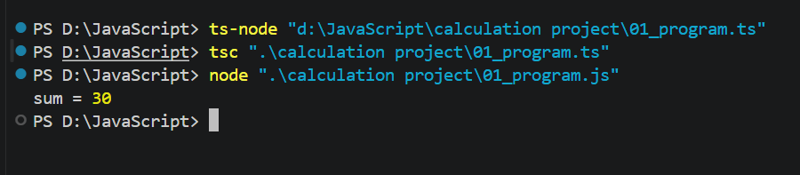

# TypeScript Basic Calculation Programs

This repository contains 20 basic TypeScript calculation programs.

## Programs Included

* 01_program.ts – Addition
* 02_program.ts – Subtraction
* 03_program.ts – Multiplication
* 04_program.ts – Division
* 05_program.ts – Modulus
* 06_program.ts – Square
* 07_program.ts – Cube
* 08_program.ts – Average
* 09_program.ts – Celsius to Fahrenheit
* 10_program.ts – Fahrenheit to Celsius
* 11_program.ts – Area of Rectangle
* 12_program.ts – Perimeter of Rectangle
* 13_program.ts – Area of Circle
* 14_program.ts – Simple Interest
* 15_program.ts – Compound Interest
* 16_program.ts – Percentage
* 17_program.ts – Swap Numbers
* 18_program.ts – Largest Number
* 19_program.ts – GST Calculator
* 20_program.ts – Discount Calculator

## Sample Output

## Technologies Used

* TypeScript
* Node.js
* VS Code

## Author

Alfaz Memon
